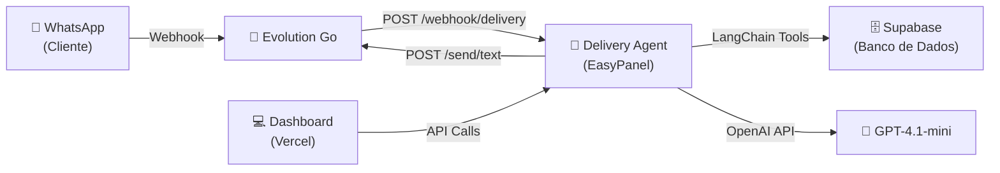
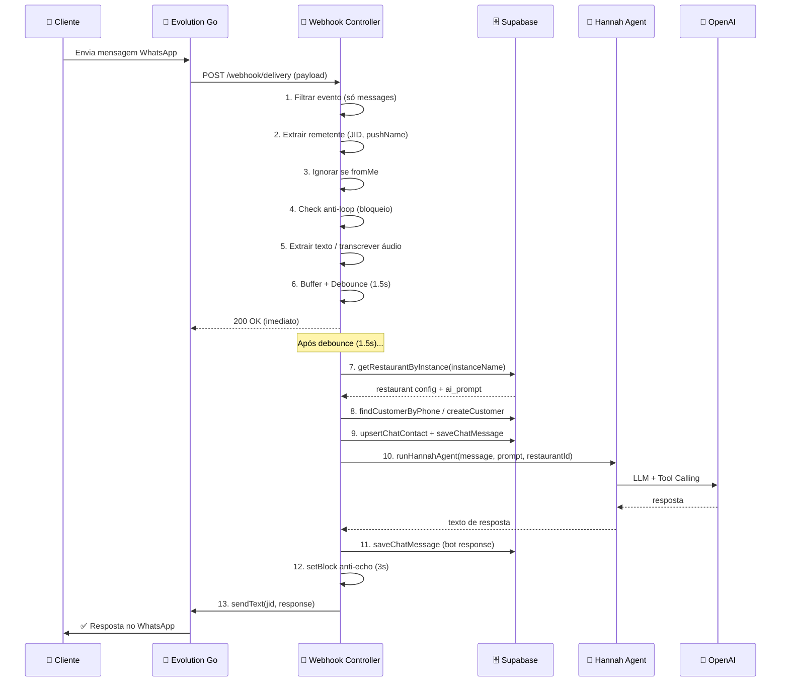
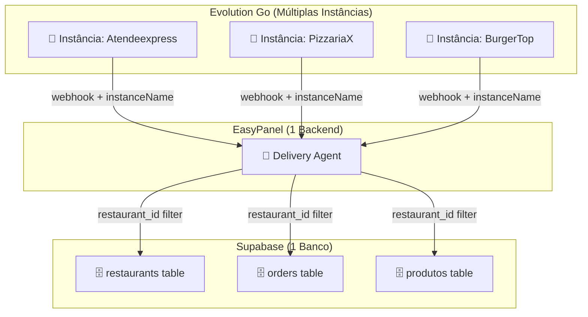
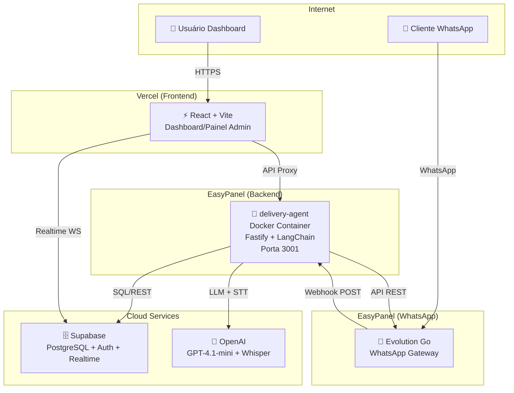

# 🏗️ Delivery Agent — Documentação Completa de Arquitetura e Deploy no EasyPanel

> Documento técnico detalhado de como o **delivery-agent** (backend do Express Delivery PRO) foi construído e configurado para rodar no EasyPanel via Docker.

---

## 📐 Visão Geral da Arquitetura

O sistema Express Delivery PRO é dividido em **duas partes independentes** que fazem deploy em plataformas diferentes:

| Componente | Tecnologia | Plataforma de Deploy | Porta |
|---|---|---|---|
| **Frontend** (Dashboard/Painel) | React + Vite + TypeScript | Vercel | — |
| **Backend** (Delivery Agent) | Fastify + LangChain + TypeScript | EasyPanel (Docker) | `3001` |

O backend é chamado de **"delivery-agent"** e é a peça central do sistema. Ele:

1. Recebe webhooks do **Evolution Go** (WhatsApp)
2. Processa mensagens com a IA **Hannah** (via LangChain/OpenAI)
3. Gerencia pedidos, clientes e cardápio no **Supabase**
4. Envia respostas de volta para o WhatsApp
5. Serve o frontend como arquivos estáticos (SPA fallback)



---

## 📁 Estrutura do Projeto Backend

```
server/
├── .dockerignore          # Arquivos ignorados pelo Docker
├── .env                   # Variáveis de ambiente (NÃO vai pro Git)
├── Dockerfile             # Instruções de build Docker (multi-stage)
├── package.json           # Dependências e scripts
├── tsconfig.json          # Configuração TypeScript
└── src/
    ├── index.ts           # Entry point — cria servidor Fastify
    ├── config.ts          # Carrega e valida variáveis de ambiente
    ├── types.ts           # Tipos TypeScript compartilhados
    ├── adapters/
    │   ├── evolutionAdapter.ts   # Client HTTP para Evolution Go
    │   └── supabaseAdapter.ts    # Client para Supabase (CRUD)
    ├── agents/
    │   ├── hannahAgent.ts        # Agente IA (LangChain + OpenAI)
    │   └── tools/
    │       ├── customerTool.ts   # Tool: buscar/criar cliente
    │       ├── menuTool.ts       # Tool: listar cardápio
    │       └── orderTool.ts      # Tool: criar pedido
    ├── controllers/
    │   ├── webhookController.ts      # Recebe mensagens do WhatsApp
    │   ├── statusController.ts       # Notifica status de pedido via WhatsApp
    │   ├── sendMessageController.ts  # Envia mensagem manual (Chat CRM)
    │   └── leadsController.ts        # Salva leads do landing page
    └── services/
        ├── memoryStore.ts       # Mapa em memória (anti-loop, stats)
        ├── messageBuffer.ts     # Buffer de mensagens (debounce 1.5s)
        ├── phoneNormalizer.ts   # Normalização de JID/telefone
        ├── mediaService.ts      # Transcrição de áudio (Whisper)
        └── greetingService.ts   # Saudação dinâmica (bom dia/boa tarde)
```

---

## 🐳 Dockerfile — Build Multi-Stage

O Dockerfile usa **two-stage build** para otimizar o tamanho da imagem final:

```dockerfile
# --- Stage 1: Build ---
FROM node:22-alpine AS builder
WORKDIR /app
COPY package.json package-lock.json* ./
RUN npm ci
COPY tsconfig.json ./
COPY src/ ./src/
RUN npm run build

# --- Stage 2: Production ---
FROM node:22-alpine AS production
WORKDIR /app
ENV NODE_ENV=production
ENV PORT=3001
COPY package.json package-lock.json* ./
RUN npm ci --omit=dev
COPY --from=builder /app/dist ./dist
RUN addgroup -g 1001 -S nodejs && adduser -S nodeuser -u 1001
USER nodeuser
EXPOSE 3001
CMD ["node", "dist/index.js"]
```

### O que cada etapa faz:

| Stage | O que faz | Por quê |
|---|---|---|
| **builder** | Instala TODAS as deps (`npm ci`), copia o TypeScript, compila com `tsc` | Precisamos do `typescript` e `@types/*` para compilar |
| **production** | Instala apenas deps de produção (`--omit=dev`), copia o JS compilado da stage builder | Imagem final menor: sem TypeScript, sem devDependencies |

### Decisões técnicas:

- **`node:22-alpine`**: Imagem leve (~50MB base vs ~350MB do `node:22`)
- **`adduser nodeuser`**: Segurança — o processo roda como usuário não-root
- **`EXPOSE 3001`**: Documentação da porta (o EasyPanel precisa saber qual porta expor)
- **`npm ci` vs `npm install`**: `ci` é mais rápido e determinístico (usa o lockfile exato)

---

## ⚙️ Nixpacks — Build Alternativo (Legado)

O EasyPanel também suporta **Nixpacks** como alternativa ao Dockerfile. Temos um [nixpacks.toml](file:///c:/Users/Hermani/Desktop/projetos/fluxo%20de%20delivery/nixpacks.toml) configurado:

```toml
[phases.setup]
nixPkgs = ["nodejs_20"]

[phases.install]
cmds = ["npm ci", "cd server && npm ci"]

[phases.build]
cmds = ["npm run build", "cd server && npm run build"]

[start]
cmd = "node server/dist/index.js"

[variables]
NODE_ENV = "production"
```

> [!NOTE]
> O Nixpacks faz **build do frontend E backend** juntos, e o backend serve os arquivos estáticos do frontend. Com o Dockerfile dentro de `/server`, apenas o backend é buildado.

---

## 🔑 Variáveis de Ambiente

As variáveis são configuradas no EasyPanel (Environment → Custom) e **NÃO ficam no repositório Git**.

| Variável | Descrição | Exemplo |
|---|---|---|
| `SUPABASE_URL` | URL do projeto Supabase | `https://xxxxx.supabase.co` |
| `SUPABASE_SERVICE_ROLE_KEY` | Chave de serviço (acesso total) | `eyJhbGci...` |
| `EVOLUTION_URL` | URL da instância Evolution Go | `https://polis-evogo.xxxx.easypanel.host` |
| `EVOLUTION_INSTANCE` | Nome da instância padrão (fallback) | `Atendeexpress` |
| `EVOLUTION_API_KEY` | API Key do Evolution Go | `5da440ba-...` |
| `OPENAI_API_KEY` | Chave de API da OpenAI | `sk-proj-...` |
| `PORT` | Porta do servidor | `3001` |
| `NODE_ENV` | Ambiente | `production` |

> [!CAUTION]
> A `SUPABASE_SERVICE_ROLE_KEY` tem **acesso total ao banco**. Nunca exponha no frontend. Use apenas no backend.

### Validação de Configuração

O arquivo [config.ts](file:///c:/Users/Hermani/Desktop/projetos/fluxo%20de%20delivery/server/src/config.ts) faz validação **fail-fast** na inicialização:

```typescript
const required = [
  'SUPABASE_URL',
  'SUPABASE_SERVICE_ROLE_KEY',
  'EVOLUTION_URL',
  'EVOLUTION_INSTANCE',
  'EVOLUTION_API_KEY',
  'OPENAI_API_KEY',
] as const;

const missing = required.filter((k) => !process.env[k]);
if (missing.length > 0) {
  console.error('❌ Variáveis obrigatórias ausentes:', missing.join(', '));
  process.exit(1);  // Mata o processo antes de iniciar
}
```

---

## 🌐 Rotas do Servidor

O servidor Fastify expõe as seguintes rotas:

| Método | Rota | Controlador | Descrição |
|---|---|---|---|
| `GET` | `/health` | inline | Health check (uptime, memória) |
| `GET` | `/stats` | inline | Estatísticas do servidor |
| `POST` | `/webhook/delivery` | [webhookController](file:///c:/Users/Hermani/Desktop/projetos/fluxo%20de%20delivery/server/src/controllers/webhookController.ts) | Recebe mensagens do WhatsApp |
| `POST` | `/webhook/status` | [statusController](file:///c:/Users/Hermani/Desktop/projetos/fluxo%20de%20delivery/server/src/controllers/statusController.ts) | Envia notificação de status |
| `POST` | `/webhook/send-message` | [sendMessageController](file:///c:/Users/Hermani/Desktop/projetos/fluxo%20de%20delivery/server/src/controllers/sendMessageController.ts) | Envia mensagem manual (CRM) |
| `POST` | `/webhook/leads` | [leadsController](file:///c:/Users/Hermani/Desktop/projetos/fluxo%20de%20delivery/server/src/controllers/leadsController.ts) | Salva leads do landing page |
| `POST` | `/setup-webhook` | inline | Configura webhook no Evolution |
| `*` | `/*` | SPA fallback | Serve o frontend (index.html) |

---

## 🧠 Fluxo de Processamento de Mensagem

Quando um cliente envia uma mensagem no WhatsApp:



### Decisões de arquitetura importantes:

1. **Debounce 1.5s**: Se o cliente manda 3 mensagens rápidas ("oi" → "quero" → "pizza"), o sistema agrupa tudo em uma única chamada ao LLM
2. **Anti-loop 3s**: Após enviar uma resposta, o sistema ignora mensagens daquele número por 3 segundos (evita que o bot responda à própria mensagem)
3. **Memória por conversa**: Cada cliente tem um `BufferWindowMemory` com janela de 20 mensagens (30 min de TTL)
4. **Multi-tenant**: O `instanceName` do webhook identifica qual restaurante está recebendo a mensagem

---

## 🏪 Multi-Tenancy (SaaS)

O sistema suporta **múltiplos restaurantes** com uma única instância do backend:



### Como funciona:

1. Cada restaurante tem sua própria instância no Evolution Go (número de WhatsApp diferente)
2. Todas as instâncias apontam o webhook para o **mesmo backend** no EasyPanel
3. O backend identifica o restaurante pelo campo `instanceId` / `instance` do payload
4. Busca a configuração no banco (`restaurants` table) para carregar o **prompt de IA personalizado**
5. Todas as queries são filtradas por `restaurant_id` para isolamento de dados

---

## 🚀 Como Configurar no EasyPanel — Passo a Passo

### 1. Criar o Serviço

1. Acesse seu EasyPanel (`https://seu-servidor.easypanel.host`)
2. Vá em **Projects** → Crie ou selecione um projeto
3. Clique em **"+ Service"** → **"App"**
4. Nome: `delivery-agent`

### 2. Conectar ao GitHub

1. Na aba **General** do serviço:
   - **Source**: GitHub
   - **Repository**: `hermanigoncalves/expressdeliverypro`
   - **Branch**: `main`
   - **Build Path**: `/server` (⚠️ IMPORTANTE: apontar para a subpasta!)
   
2. O EasyPanel vai encontrar o `Dockerfile` dentro de `/server` automaticamente

### 3. Configurar Variáveis de Ambiente

Na aba **Environment** → **Custom**:

```env
SUPABASE_URL=https://mrhidzhbiqkyilyfnyvh.supabase.co
SUPABASE_SERVICE_ROLE_KEY=<sua_service_role_key>
EVOLUTION_URL=https://polis-evogo.8vsz2a.easypanel.host
EVOLUTION_INSTANCE=Atendeexpress
EVOLUTION_API_KEY=<sua_api_key>
OPENAI_API_KEY=<sua_openai_key>
PORT=3001
NODE_ENV=production
```

### 4. Configurar Domínio/Porta

Na aba **Domains**:

1. Adicione um domínio (ex: `delivery-agent.8vsz2a.easypanel.host`)
2. **Container Port**: `3001`
3. HTTPS: ativado automaticamente pelo EasyPanel

### 5. Deploy

1. Clique em **"Deploy"** ou **"Redeploy"**
2. O EasyPanel vai:
   - Clonar o repositório
   - Executar o Dockerfile no diretório `/server`
   - Criar a imagem Docker
   - Iniciar o container
3. Verifique os logs em tempo real na aba **"Logs"**

### 6. Verificar Health

Acesse: `https://seu-dominio.easypanel.host/health`

Resposta esperada:
```json
{
  "status": "ok",
  "uptime": 123.456,
  "timestamp": "2026-07-07T12:00:00.000Z",
  "memory": { "conversations": 0, "blocks": 0 }
}
```

### 7. Configurar Webhook no Evolution Go

O último passo é dizer ao Evolution Go para enviar webhooks para o seu backend:

```bash
POST https://seu-dominio.easypanel.host/setup-webhook
Content-Type: application/json

{
  "url": "https://seu-dominio.easypanel.host/webhook/delivery"
}
```

Ou configure diretamente no painel do Evolution Go:
- **Webhook URL**: `https://delivery-agent.xxxx.easypanel.host/webhook/delivery`
- **Events**: `MESSAGES_UPSERT`

---

## 🔄 Deploy Contínuo (CI/CD)

Com a integração GitHub → EasyPanel:

1. Você faz `git push origin main`
2. O EasyPanel detecta a mudança automaticamente
3. Rebuild da imagem Docker
4. Reinício do container com zero-downtime

---

## 🛡️ Segurança Implementada

| Medida | Implementação |
|---|---|
| **Usuário não-root** | `adduser nodeuser` no Dockerfile |
| **Deps de produção** | `npm ci --omit=dev` (sem devDependencies) |
| **Fail-fast** | Config valida envs antes de iniciar |
| **Anti-loop** | Bloqueio de 3s após resposta |
| **Error handling** | `uncaughtException` + `unhandledRejection` tratados |
| **CORS** | Habilitado com `origin: true` |
| **Sem secrets no Git** | `.env` no `.gitignore`, `.dockerignore` |

---

## 📊 Dependências do Backend

| Pacote | Versão | Uso |
|---|---|---|
| `fastify` | ^5.0.0 | Framework HTTP (mais rápido que Express) |
| `@fastify/cors` | ^10.0.0 | Middleware CORS |
| `@fastify/static` | ^9.1.3 | Servir frontend estático |
| `@langchain/openai` | ^0.3.0 | Integração OpenAI via LangChain |
| `langchain` | ^0.3.0 | Framework de agentes IA |
| `@supabase/supabase-js` | ^2.39.7 | Client Supabase |
| `axios` | ^1.6.0 | Client HTTP (Evolution Go API) |
| `openai` | ^4.28.0 | SDK OpenAI (transcrição Whisper) |
| `zod` | ^3.22.0 | Validação de schema |
| `dotenv` | ^16.4.5 | Carregar variáveis de ambiente |

---

## 🧩 Resumo Visual da Infraestrutura



---

> [!TIP]
> **Para adicionar um novo restaurante ao sistema:**
> 1. Crie uma nova instância no **Evolution Go** com o número do restaurante
> 2. Configure o webhook dessa instância para apontar ao mesmo backend
> 3. No Dashboard, vá em **Restaurantes** → **Novo** e preencha os dados
> 4. Pronto! O sistema identifica automaticamente qual restaurante é pelo `instanceName`
