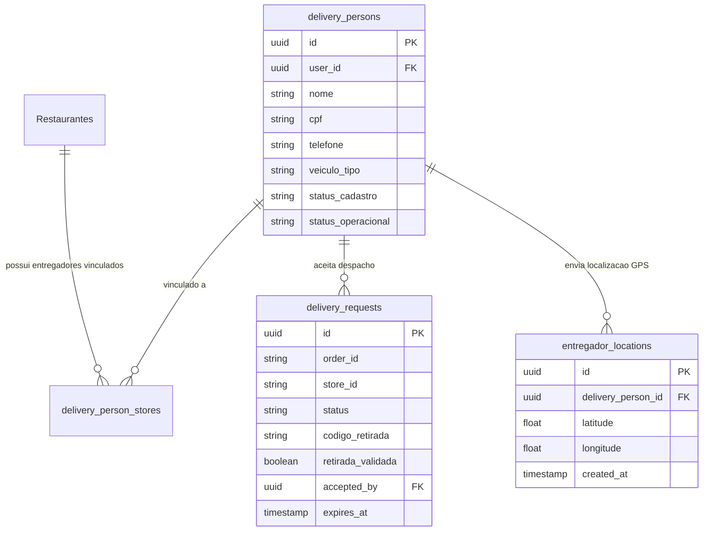

# Documentação Técnica e Operacional: Módulo de Delivery — Sistema PedeAí

---

## 1. Visão Geral do Módulo

O **Módulo de Delivery do Sistema PedeAí** é a solução integrada para automação de atendimento via WhatsApp, despacho inteligente de pedidos, gestão de entregadores e acompanhamento da jornada de entrega do restaurante.

### Principais Objetivos:
- **Atendimento Autônomo por IA**: Agente dedicado a responder dúvidas sobre entregas, cardápio, taxa de entrega e regras da casa.
- **Despacho Automático (Dispatch)**: Notificação instantânea ao cliente via WhatsApp quando o pedido sai para entrega no Kanban.
- **Gestão Integrada de Entregadores**: Controle de cadastro, aprovação de documentos, vínculo com lojas e status operacional (*offline*, *disponível*, *em entrega*).
- **Segurança de Retirada**: Validação por código alfanumérico único de 6 caracteres.
- **Geolocalização**: Estrutura para rastreamento GPS em tempo real.

---

## 2. Arquitetura de Banco de Dados (Supabase / PostgreSQL)

O módulo de Delivery utiliza um conjunto de tabelas dedicadas e extensões na tabela principal de restaurantes.



### 2.1. Tabela `delivery_persons` (Entregadores)
Armazena a ficha cadastral, status de aprovação e situação operacional dos entregadores.

| Campo | Tipo | Descrição / Restrições |
| :--- | :--- | :--- |
| `id` | `UUID` | Chave primária (`gen_random_uuid()`) |
| `user_id` | `UUID` | Referência ao usuário em `auth.users` |
| `nome` | `TEXT` | Nome completo do entregador |
| `cpf` | `VARCHAR(14)` | CPF único do entregador |
| `telefone` | `VARCHAR(20)` | Telefone de contato |
| `veiculo_tipo` | `TEXT` | Tipo do veículo (`'moto'`, `'bicicleta'`, `'carro'`) |
| `veiculo_placa` | `VARCHAR(10)` | Placa do veículo (quando aplicável) |
| `documento_frente_url` | `TEXT` | URL da foto da frente do documento (Storage) |
| `documento_verso_url` | `TEXT` | URL da foto do verso do documento (Storage) |
| `selfie_documento_url` | `TEXT` | URL da selfie com documento (Storage) |
| `app_navegacao` | `TEXT` | Preferência de navegação (`'google_maps'`, `'waze'`) |
| `status_cadastro` | `TEXT` | Status (`'pendente_aprovacao'`, `'aprovado'`, `'rejeitado'`, `'suspenso'`) |
| `motivo_rejeicao` | `TEXT` | Motivo de eventual rejeição de cadastro |
| `status_operacional` | `TEXT` | Status de trabalho (`'offline'`, `'disponivel'`, `'em_entrega'`) |

### 2.2. Tabela `delivery_person_stores` (Vínculo Entregador ↔ Loja)
Permite que entregadores sejam vinculados a uma ou mais lojas específicas.

- `delivery_person_id`: Referência ao entregador.
- `store_id`: Identificador da loja/restaurante.
- `status`: Status do vínculo (`'ativo'`, `'inativo'`, `'pendente'`).

### 2.3. Tabela `delivery_requests` (Chamadas de Despacho)
Regista o despacho individual de cada pedido para a frota de entregadores.

- `order_id`: Código/ID do pedido a ser entregue.
- `store_id`: ID do restaurante.
- `status`: Estado da solicitação (`'pendente'`, `'aceito'`, `'expirado'`, `'cancelado'`).
- `codigo_retirada`: Código de 6 dígitos alfanuméricos gerado via `generate_pickup_code()`.
- `retirada_validada`: Booleano confirmando se a retirada foi validada na cozinha.
- `accepted_by`: ID do entregador em `delivery_persons` que aceitou a corrida.
- `expires_at`: Data/hora limite de expiração da chamada.

### 2.4. Tabela `entregador_locations` (Rastreamento GPS)
Registra o histórico de coordenadas dos entregadores para acompanhamento em tempo real.

- `delivery_person_id`: FK para `delivery_persons`.
- `latitude` / `longitude`: Coordenadas geográficas.
- `created_at`: Carimbo de data/hora do envio do sinal de GPS.

### 2.5. Extensões na Tabela `Restaurantes`
A migration `migration_add_delivery_habilitado.sql` adiciona os campos de controle e IA:

- `delivery_habilitado` (`BOOLEAN`): Liga/desliga a operação de delivery da loja.
- `evolution_instancia_delivery` / `waha_session_delivery` (`TEXT`): Nome da sessão de WhatsApp exclusiva para atendimento de Delivery.
- `evolution_apikey_delivery` / `waha_apikey_delivery` (`TEXT`): API Key da instância de delivery.
- `personalidade_agente_delivery` (`TEXT`): Prompt de persona do agente de delivery.
- `regras_estabelecimento_delivery` (`TEXT`): Regras de negócio (ex: taxas por bairro, raio de entrega, tempo médio de espera).
- `exemplos_conversa_delivery` (`TEXT`): Exemplos (*few-shot*) para orientar as respostas do LLM.

---

## 3. Agente IA de Delivery & WhatsApp

O sistema possui um agente especializado no fluxo de Delivery, podendo operar tanto em instâncias dedicadas de WhatsApp quanto compartilhadas.

```
                  ┌────────────────────────┐
                  │ Mensagem WhatsApp      │
                  │ (Cliente / Delivery)   │
                  └───────────┬────────────┘
                              │
                              ▼
                  ┌────────────────────────┐
                  │ Webhook Controller     │
                  │ POST /webhook/delivery │
                  └───────────┬────────────┘
                              │
                              ▼
            ┌────────────────────────────────────┐
            │ Identificação do Restaurante       │
            │ (Verifica 'waha_session_delivery'  │
            │  ou 'evolution_instancia_delivery')│
            └─────────────────┬──────────────────┘
                              │
                              ▼
            ┌────────────────────────────────────┐
            │ PedeAi Agent (Role: delivery)      │
            │ - Prompt de Delivery Dedicado      │
            │ - Validação de Endereço/Cardápio   │
            └─────────────────┬──────────────────┘
                              │
                              ▼
                  ┌────────────────────────┐
                  │ Resposta Automatizada  │
                  │ via Waha / Evolution   │
                  └────────────────────────┘
```

---

## 4. Fluxo de Kanban, Despacho (Dispatch) e Notificações

A integração do painel administrativo com a entrega é acionada diretamente pelas transições do **Kanban de Pedidos** (`KanbanBoard.tsx`).

### 4.1. Serviços Envolvidos
1. **`deliveryAdminService.ts`**:
   - Função `dispatchToDeliveryAgent(pedido)`
   - Monta o `DispatchPayload` com dados do pedido (ID, mesa/identificador, telefone do cliente, itens, valor total e horário do despacho).
   - Dispara requisição HTTP POST para o endpoint de despacho (`/api/delivery/dispatch` ou webhook configurado).

2. **`deliveryAgentService.ts`**:
   - Função `syncOrderStatus(pedido, newStatus)`
   - Mantém o agente externo (no EasyPanel / n8n) sincronizado em tempo real sobre qualquer alteração de estado no Kanban (Preparo, Pronto, Entregue, etc.).

3. **Notificação ao Cliente**:
   - Ao despachar o pedido, o servidor limpa e formata o telefone do cliente (`normalizePhone`) e envia a mensagem automática:
     > 🛵 *Seu pedido #123 saiu para entrega!*
     > Obrigado por comprar conosco. Em breve estará em seu endereço!
