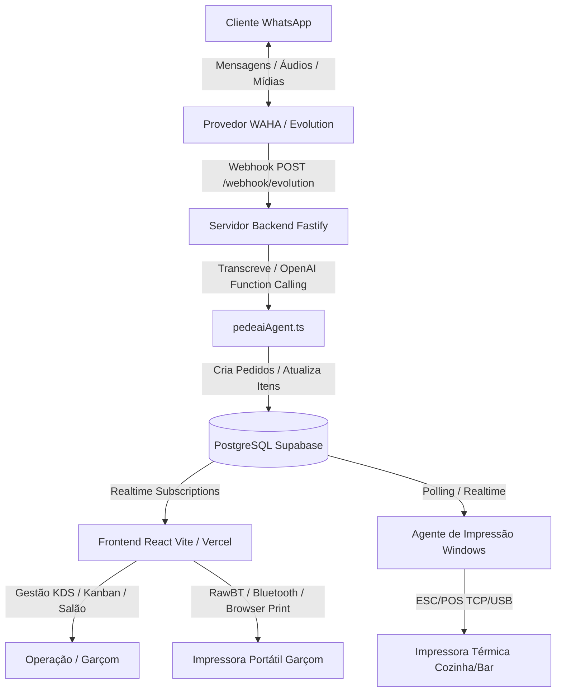

# 🏛️ Arquitetura do Sistema PedeAí

> Documento de Referência Arquitetural | Protocolo: Google Mantis (Etapa 2/10)

## 1. Visão Geral do Sistema e Topologia

O **Sistema PedeAí** é uma solução SaaS multi-tenant orientada a eventos para automação de atendimento em restaurantes, gestão de comandas/mesas e orquestração de pedidos em tempo real.



---

## 2. Mapeamento de Entidades do Banco de Dados (Supabase PostgreSQL)

### 2.1. `Restaurantes` (Tenant Central)
* **Chave Primária:** `id: text (UUID ou slug)`
* **Campos Principais:**
  * `nome: text`, `email: text`, `senha: text (Plaintext ou Bcrypt)`
  * `quantidade_mesas: text`, `quantidade_max_mesas: text`
  * `horario_abertura: text`, `horario_fechamento: text`, `horario_fecha_cozinha: text`
  * `gerencia_estoque: boolean`, `alerta_estoque_baixo: number`, `alerta_estoque_critico: number`
  * `modo_cobranca: 'mesa' | 'comanda'` (Define se cada check-in é individual ou unificado na mesa)
  * `cobranca_meio_a_meio: 'mais_cara' | 'media'`
  * `meia_pizza_habilitada: boolean`
  * `taxa_servico: number (ex: 10)`
  * `couvert_habilitado: boolean`, `couvert_valor: number`
  * `waha_session: text`, `waha_apikey: text` (Credenciais WhatsApp da instância)
  * `delivery_habilitado: boolean`, `waha_session_delivery: text`

### 2.2. `Usuários` (Clientes / Comandas Ativas)
* **Chave Primária:** `id: bigint`
* **Campos:** `telefone: text`, `id_restaurante: text`, `mesa_atual: text`, `Status: text ('Ativo' | 'Inativo')`, `nome: text`, `quantas_vezes_foi: number`, `chat_humano: boolean`

### 2.3. `Pedidos` & `ItensPedido`
* **Pedidos:**
  * `id: bigint`, `created_at: timestamp`
  * `restaurante_id: text` (FK -> `Restaurantes.id`)
  * `mesa: text`, `status: text ('Pendente' | 'Preparando' | 'Pronto' | 'Entregue' | 'Cancelado')`
  * `Subtotal: text`, `quantidade: text`, `itens: text`, `descricao: text`
  * `comanda_id: text` (Vínculo da comanda individual)

### 2.4. `Produtos` & `estoque_restaurantes`
* **Produtos:** `id: bigint`, `nome: text`, `preco: text`, `categoria: text`, `estacao_id: text`, `disponivel: boolean`, `restaurante_id: text`
* **Estoque:** `produto_id: bigint`, `restaurante_id: text`, `quantidade_atual: text`

### 2.5. `estacoes_preparo` & `impressoras`
* **Estações:** `id: uuid`, `nome: text (ex: Cozinha, Bar, Forno)`, `restaurante_id: text`
* **Impressoras:** `id: uuid`, `nome: text`, `tipo_conexao: 'tcp' | 'usb' | 'bluetooth' | 'browser'`, `endereco_ip: text`, `porta: number`, `estacao_id: uuid`, `restaurante_id: text`

### 2.6. `admin_acessos`
* **Campos:** `id: bigint`, `email: text`, `senha: text`, `created_at: timestamp`

---

## 3. Contratos de Interface e DTOs

### 3.1. Webhook Evolution / WAHA (`POST /webhook/evolution`)
```typescript
interface EvoWebhookPayload {
  event: string;
  instance: string;
  data: {
    key: { remoteJid: string; fromMe: boolean; id: string };
    pushName: string;
    message: { conversation?: string; extendedTextMessage?: { text: string }; audioMessage?: any };
    messageTimestamp: number;
  };
}
```

### 3.2. Encerramento de Conta (`POST /webhook/Envia-conta`)
```typescript
interface CloseBillPayload {
  telefone: string;
  nome: string;
  numero_mesa: number;
  itens: string;
  subtotal: string;
  taxa: string;
  couvert?: string;
  total: string;
  restaurante_id?: string;
  tipo?: 'mesa' | 'comanda';
}
```

---

## 4. Limites de Confiança e Isolamento Multi-Tenant

1. **Isolamento de Restaurante:** Todas as queries em `Pedidos`, `Produtos`, `Mesas` e `Mensagens` filtram obrigatoriamente por `restaurante_id`.
2. **Fallback Resiliente:** Frontend opera de maneira autônoma com Supabase Client quando rodando em ambiente serverless/Vercel sem backend dedicado.
3. **Modo Comanda vs Modo Mesa:**
   - No restaurante **San Pio**, o modo é estritamente **`comanda`**.
   - No fechamento de conta por WhatsApp, a pergunta "Quer dividir a conta?" só deve ocorrer se `modo_cobranca === 'mesa'`.
